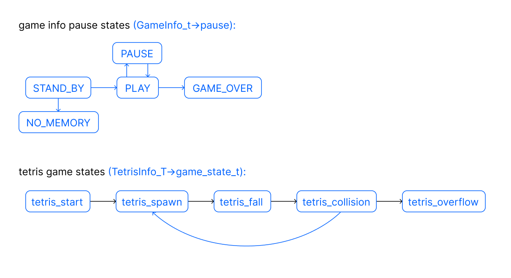

# BrickGame Tetris

Консольная игра Tetris на C11. Библиотека игровой логики + терминальный интерфейс на ncurses, который может поддерживать другие игры.

## Стек
- C11
- gcc
- ncurses
- check (unit-тесты)
- Makefile
- Doxyfile

## Структура
- brick_game/tetris:  логика игры, конечный автомат
- src/gui/cli:  интерфейс на ncurses

## Сборка
- make all - собрать
- make install - установить в произвольный каталог
- make uninstall - удалить из произвольного каталога
- make test - запустить тесты
- make gcov_report - отчёт о покрытии тестами
- make clean - очистить

## Управление
- Enter: начать игру
- P: пауза
- Q: выход
- Стрелки влево/вправо: движение
- Стрелка вниз: ускоренное падение
- Пробел: вращение

## Характеристики
- Реализованы все 7 фигур тетриса
- Есть окно со следующей фигурой
- Уничтожение заполненных линий
- Отображаются набранные очки и рекорд
- Уровни 1–10, с переходом на новый уровень увеличивается сложность

# Состояния конечного автомата игры
Диаграмма, объясняющая работу КА в игре

